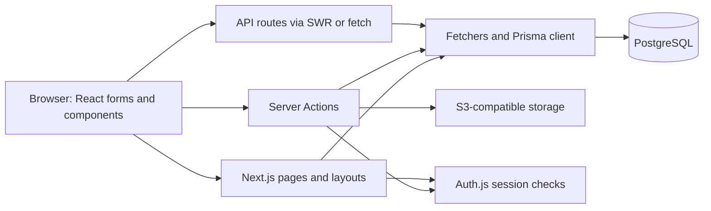

**Kotova — project refresher and code review**

Reviewed on September 21, 2026. This report describes the supplied source code and dependency files. It does not establish the state of a live deployment or assess current dependency advisories.

**What the project does**

Kotova is a Russian-language website for Russian language and literature teacher Viktoria Kotova, combined with a quiz and learning-materials platform. The public site presents recent tests, categories, downloadable theory files, and the teacher’s biography, certificates, student achievements, and testimonials.

Students register, sign in, take quizzes, see explanations and scores, and view their results. Teachers create and edit quizzes, attach reusable files, and inspect students’ attempts. Admin navigation also exposes category and user management, including role changes. These are the intended roles shown by the interface; server-side enforcement is incomplete, as detailed below.

The application is a single Next.js project containing the frontend, authentication, backend operations, and database access. PostgreSQL and S3-compatible object storage are its main external services.

**Technology stack**

Versions below are declared in [package.json](package.json); a caret denotes a permitted version range.

| Area | Technology | How it is used |
| --- | --- | --- |
| Framework | Next.js **15.0.2**, App Router | Pages, nested layouts, server rendering, Server Actions, API routes |
| UI runtime | React / React DOM **19.0.0-rc-7c8e5e7a-20241101** | Server and client components; React type packages also use RC aliases |
| Language | TypeScript **^5.3.3** | Strict mode; `@/*` aliases `src/*` |
| Database | PostgreSQL; Prisma / Prisma Client **5.21.1** | Relational models, queries, migrations, generated types |
| Authentication | NextAuth/Auth.js **5.0.0-beta.25**, Prisma adapter | Email/password credentials; JWT sessions with a one-year maximum age |
| Styling | Tailwind CSS **^3.3.6**, Sass, PostCSS | Utility classes, global SCSS, component SCSS modules |
| UI components | shadcn/ui-style local components, Radix UI | Forms, dialogs, menus, tables, popovers; Lucide/React Icons and Sonner notifications |
| Forms | React Hook Form **^7.49.3**, Zod **^3.22.4** | Form state, field arrays, shared validation schemas |
| Client data/state | SWR **^2.2.4**, Zustand **^4.4.7**, React Context | Fetching/filtering lists, small UI stores, per-feature context |
| File storage | AWS SDK v2 **^2.1691.0**, S3-compatible endpoint | Uploads and signed download URLs |
| Installable app support | `@ducanh2912/next-pwa` **^10.2.2** | Production service-worker configuration, manifest, icons, offline page |
| Monitoring | Vercel Analytics and Speed Insights | Included in production by the root layout |
| Development tools | ESLint 8, Prettier 3, `tsx` | Lint script, formatting dependencies, Prisma seed execution |

The active database is PostgreSQL: `@prisma/adapter-libsql` remains a dependency, but the application instantiates a normal PostgreSQL Prisma client. Google/Yandex OAuth providers are commented out. `bcrypt` is installed but unused in the authentication implementation. A commented S3 response suggests historical Backblaze B2 usage; the actual endpoint is supplied by environment variables. Vercel integrations suggest deployment intent, but the current host cannot be established from this checkout.

**Repository map**

The `src` directory contains 445 files, including 203 component files and 176 library files. There are 23 page entry points, 5 API route handlers, and 11 SQL migrations.

```text
kotova/
├── src/
│   ├── app/
│   │   ├── (auth)/             Sign-in, sign-up, auth-error pages/layout
│   │   ├── (main)/             Public site and /my dashboard pages
│   │   ├── api/                Authentication, categories, users, results, IP logging
│   │   ├── layout.tsx          Metadata, notifications, analytics, IP logger
│   │   └── globals.scss        Global styles and Tailwind layers
│   ├── components/
│   │   ├── ui/                Local reusable UI primitives
│   │   ├── mainLayout/        Header, sidebar, mobile navigation
│   │   ├── dashboard/         Dashboard cards, categories, quiz creation
│   │   ├── myTest/            Quiz editing and teacher result views
│   │   ├── takeTest/          Quiz-taking UI and question renderers
│   │   ├── testResult/        Scores, answers, explanations
│   │   └── ...                Authentication, profiles, browsing, files
│   ├── lib/
│   │   ├── actions/           Server Actions: writes and some paginated reads
│   │   ├── fetchers/          Primarily Prisma queries, organized by feature
│   │   ├── checkTestAnswers/  Grading, result creation, average-score updates
│   │   ├── zod/schemas/       Validation for authentication, quizzes, profiles
│   │   ├── contexts/         Feature-specific React context providers
│   │   ├── hooks/            Form, filtering, SWR, and other React hooks
│   │   ├── stores/           Zustand UI state
│   │   ├── types/            Shared types and integer role/question constants
│   │   ├── db.ts             Shared Prisma client
│   │   └── s3.ts             S3 client, uploads, signed URLs
│   ├── auth.ts               Auth.js setup and credential validation
│   ├── middleware.ts         Composes the URL-header middleware
│   ├── middlewares/          Middleware helpers; withAuth is not wired in
│   └── styles/               Shared card SCSS
├── prisma/                   Schema, migration history, sample seed
├── images/                   Imported profile, certificate, testimonial images
├── public/                   PWA manifest and app icons
├── next.config.js            PWA, remote images, SVG handling, action size limit
├── tailwind.config.ts        Theme configuration
├── package.json              Dependencies and scripts
├── pnpm-lock.yaml            Lockfile matching the current manifest
└── package-lock.json         Older dependency snapshot
```

Route groups such as `(main)` and `(auth)` organize layouts without appearing in URLs. Most components are grouped by product feature, while shared data and behavior live under `lib`. The create/edit quiz interfaces have parallel component and schema trees, so changes to question types often require edits in both places.

**Page and API map**

| URL | Purpose and observed access behavior |
| --- | --- |
| `/` | Ten recently created tests and Telegram community links |
| `/about`, `/terms-of-service` | Teacher portfolio and terms |
| `/categories`, `/categories/[id]` | Browse tests; search, grade filters, paginated loading |
| `/files` | Public theory-material file listing |
| `/sign-in`, `/sign-up`, `/auth-error` | Credential authentication screens |
| `/take-test/[id]` | Quiz form; requires sign-in |
| `/test-result/[id]` | Individual attempt and explanations; no access check in the page |
| `/users/[id]`, `/users/[id]/edit` | Profile/results and profile editing |
| `/my` | Signed-in dashboard with role-dependent cards |
| `/my/tests`, `/my/tests/create` | Teacher/admin quiz list and creation screen |
| `/my/tests/[id]`, `/my/tests/[id]/edit` | Owner-checked result dashboard and edit screen |
| `/my/test-results` | Signed-in user’s result history |
| `/my/manage-files` | Teacher/admin file-management screen |
| `/my/categories` | Category management; page itself lacks an access check |
| `/my/users` | Admin-checked user-management screen |
| `/~offline` | Offline fallback page |

The five HTTP handlers are `/api/auth/[...nextauth]`, `/api/categories`, `/api/users`, `/api/test-results/[id]`, and `/api/log-ip`. In the results API, `[id]` is the **test ID**, whereas `/test-result/[id]` uses an **attempt ID**. Most mutations use Server Actions instead of dedicated API routes.

**How requests and data move**



Server components generally load data through `lib/fetchers` and render or pass it to client components. Many fetchers use React `cache()` for request-level memoization. SWR supports client-side refresh and filtering, with server-provided fallback data in the teacher results screen. Forms combine React Hook Form with Zod, then invoke a Server Action. Mutations commonly call `revalidatePath` to refresh affected pages.

Quiz creation starts in [the creation form](src/components/dashboard/tests/add/Form/Index.tsx). Draft values persist in browser `localStorage`. [createTest.ts](src/lib/actions/createTest.ts) creates the test, connects files, then inserts questions and options. Editing follows a separate form tree and [editTest.ts](src/lib/actions/editTest.ts), which calculates additions, removals, and updates.

Quiz submission calls [checkTestAnswers.ts](src/lib/actions/checkTestAnswers.ts). It reloads the test from PostgreSQL, checks each question, calculates `correct questions / total questions × 100`, saves an attempt with answer details, and updates test/user averages. Text and table answers are compared case-insensitively, without trimming whitespace. Radio and checkbox questions share an exact-selection checker; table questions require every cell to match. Each question contributes one correct/incorrect outcome, with no partial credit.

Uploads travel through a Server Action into S3, while PostgreSQL stores their key, filename, size, MIME type, and owner. Files can be attached to multiple tests. Downloads use signed URLs valid for 24 hours. The Next.js action body limit is configured to 500 MB; uploads are buffered in memory.

**Database model**

[prisma/schema.prisma](prisma/schema.prisma) defines 13 models:

| Models | Responsibility and relationships |
| --- | --- |
| `User` | Identity, integer role, password field, profile, average score; owns tests/files and has results |
| `Account`, `Session`, `VerificationToken` | Auth adapter models; JWT is the configured session strategy |
| `Category` | Groups tests |
| `Test` | Name, grade array, category, creator, timestamps, average score, questions, attempts, files |
| `TestQuestion`, `TestQuestionOption` | Ordered questions/options, correct answers, explanations, table cells |
| `TestResult` | One attempt: user, test, percentage score, timestamp |
| `TestResultAnswer`, `TestResultAnswerOption` | Submitted answers and correctness |
| `TestFile` | S3 object metadata; many-to-many relationship with tests |
| `Ip` | IP addresses observed for signed-in users |

Roles are `STUDENT=1`, `TEACHER=2`, `ADMIN=3`. Question types are `TEXT=1`, `RADIO=2`, `CHECKBOX=3`, `TABLE=4`. These are application constants rather than database enums. Question variants share tables with nullable fields.

Results reference live questions rather than immutable question snapshots. Deleting a test cascades to its attempts; deleting a question cascades to its recorded answers. Consequently, editing an existing test can change or remove information underlying historical results while leaving previously stored scores.

**Local setup and deployment refresher**

There is no `.env` example, Node version pin, `packageManager` field, container setup, or CI configuration in this checkout. The README is the original create-next-app template. No `node_modules` directory is present.

The pnpm lockfile’s dependency specifiers match `package.json`. The npm lockfile differs substantially: it resolves Next.js 14.1.0, React 18.2.0, Prisma 5.8.0, and NextAuth beta.5. Use the pnpm snapshot as the starting point for reproducing this source; an unchanged `npm ci` is not a reproducible setup for the current manifest. The exact historical Node/pnpm versions are not recorded.

| Environment setting | Purpose |
| --- | --- |
| `DATABASE_URL` | PostgreSQL connection string, read by Prisma |
| `S3_ENDPOINT` | Object-storage endpoint |
| `S3_ACCESS_KEY_ID`, `S3_SECRET_ACCESS_KEY` | Object-storage credentials |
| `S3_BUCKET_NAME` | Storage bucket |
| Auth.js secret configuration, normally `AUTH_SECRET` | Framework-managed authentication secret; no example is provided in this repository |
| `VERCEL_URL`, `PORT` | Metadata base URL selection |
| `NODE_ENV` | Production analytics and PWA behavior |

The S3 client reads endpoint and credentials when its module loads, so missing storage configuration can affect code paths before an upload occurs. Restore environment settings from the original hosting configuration if available.

For a disposable local database, after configuring the environment and installing a compatible pnpm version, the intended sequence is:

```bash
pnpm install --frozen-lockfile
pnpm exec prisma generate
pnpm exec prisma migrate deploy
pnpm dev
```

These commands were not executed during this review. `migrate deploy` modifies the database named by `DATABASE_URL`. The seed is optional and needs cleanup: it creates a known sample admin and its test upserts look up fixed IDs without setting those IDs on creation, so repeated seeding can duplicate tests.

| Script | Actual behavior |
| --- | --- |
| `dev` | `next dev --turbo` |
| `build` | Generates Prisma Client, then builds Next.js |
| `start` | Serves an existing production build |
| `buildandstart` | Builds and starts; does not explicitly generate Prisma Client or migrate |
| `buildproduction` | Generates Prisma Client, applies database migrations, then builds |
| `lint` | Runs `next lint`; no ESLint configuration is supplied |

Production hosting must support the server-side application, database connections, and storage access. PWA caching is enabled outside development; offline submission and caching behavior have not been tested. The custom SVG loader is defined in the Webpack configuration, while development requests Turbopack, so parity should be checked if SVG component imports are used.

**Findings to address before returning the application to use**

The following findings come from tracing the source. They are not claims that a deployed system has been exploited.

1. **Critical: plaintext passwords and browser exposure of user records.** [Registration](src/lib/credentialsSignUp/createUser.ts) stores the supplied password directly, and [authentication](src/auth.ts) compares it directly. The [profile query](src/lib/fetchers/userProfile/getUser.ts) selects every scalar user field, including `password`; the public [profile page](src/app/(main)/users/[id]/page.tsx) passes that object to a client context provider. Category pagination likewise returns complete creator records through [getCategoryTests.ts](src/lib/fetchers/getCategoryTests.ts). Restrict returned fields at every browser boundary and implement password hashing with a plan for existing accounts.

2. **High: permission checks differ between pages and backend entry points.** Category create/delete actions have no authentication checks. Quiz creation and file upload require sign-in but omit the teacher/admin check used in the UI. Quiz edit/delete actions omit ownership checks; editing also assigns the caller as creator. `/api/users` exposes contact fields without an admin check, and `/api/test-results/[id]` has no owner check. The individual result page also lacks access enforcement. Add authorization inside each action/handler, not solely in pages or navigation. The role-change action already explicitly checks for an admin and provides a useful local example.

3. **High: quiz answer keys reach the browser before submission.** [The quiz fetcher](src/lib/fetchers/takeTest/getTest.ts) includes `correctAnswerText`, explanations, and full options containing `isCorrect` and `tableColumnAnswer`. [The page](src/app/(main)/take-test/[id]/page.tsx) passes the entire result to a client provider. Use a question payload containing only the fields needed to render the form; keep grading data on the server.

4. **High: shared-file deletion is inconsistent.** [Deleting a test](src/lib/actions/deleteTest.ts) deletes its attached S3 objects even though files can belong to other tests; file metadata remains. Conversely, [deleting a file](src/lib/actions/deleteFile.ts) removes its database record without deleting its S3 object. Define shared-file ownership and deletion rules, then keep database metadata and storage operations consistent.

5. **Correctness: multi-step writes can leave partial state.** Creation, editing, and submission perform multiple writes without an encompassing transaction. File links in `createTest.ts` use an unawaited `files.map(async ...)`. Result creation and average updates run independently, so an average can change even when saving the attempt fails; concurrent attempts can overwrite average updates. `Test.avgScore` is also an integer column while the calculation produces fractional values. Use coherent write boundaries and decide how averages should be stored or recomputed.

6. **Correctness: grading relies on array position.** The checker pairs questions/options with submitted answers by array index even though IDs are supplied. The quiz and grading queries do not explicitly order these arrays, and validation does not enforce the expected answer count against the stored test. Match by IDs, validate membership/completeness, and order presentation queries explicitly.

7. **Maintenance: setup and configuration need consolidation.** Keep one authoritative lockfile and record runtime/tool versions. [The metadata URL](src/app/layout.tsx) uses the literal string `"https://${process.env.VERCEL_URL}"`, so it does not interpolate the deployment hostname. `components.json` points to `globals.css`, while the actual stylesheet is `globals.scss`. The create/edit quiz trees duplicate substantial logic, and the edit action ignores its `files` input. No automated test suite or test script was found.

**Suggested reading order**

For a quick return to development, read [package.json](package.json), [the Prisma schema](prisma/schema.prisma), [auth.ts](src/auth.ts), and [the dashboard](src/app/(main)/my/page.tsx). Then follow one complete feature through its page, component, schema, action, and fetcher. Quiz creation and submission are the most useful examples because they cover nearly every major part of the system.

**Review coverage and limits**

Reviewed the repository inventory, package/configuration files, schema and migration structure, layouts/routes, authentication, main quiz workflows, file storage, client state, and relevant data-exposure paths. Checked dependency specifiers in both lockfiles against the manifest and verified the metadata string’s literal behavior with Node. Build, lint, database migrations, browser behavior, and integration tests were not run because dependencies and service configuration are absent. Only this report was added; application code was not changed.
